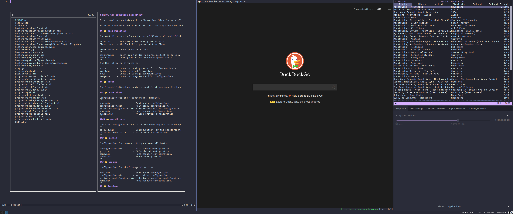

# NixOS Configuration Repository

This repository contains all configuration files for my NixOS system. It utilizes the Nix Flakes system to manage and reproduce the configurations across different hosts.

The system is set up with x11, i3, qutebrowser, helix, fish amongst other applications. Secrets and passwords are managed by 1password and the cli integration. It is mostly themed to dracula theme.



Below is a detailed description of the directory structure and configuration files:

## 📁 Root Directory

The root directory includes the main \`flake.nix\` and \`flake.lock\` files which drive the usage of Nix Flakes in this configuration.
```
flake.nix    - The main flake configuration file.
flake.lock   - The lock file generated from flake.
```
Other essential configuration files:
```
nixpkgs.nix  - Specifies the Nix Packages collection to use.
shell.nix    - Configuration for the development shell.
```
And the following directories:
```
hosts        - Contains configuration for different hosts.
overlays     - Contains Nixpkgs overlays.
pkgs         - Contains package configurations.
programs     - Contains program-specific configurations.
```
## 📁 Hosts

The \`hosts\` directory contains configurations specific to different machines:

### 📂 ariel

Configuration for the \`ariel\` machine. Laptop.
```
boot.nix                 - Bootloader configuration.
configuration.nix        - Main NixOS configuration.
hardware-configuration.nix - Hardware-specific configuration.
home.nix                 - Home manager configuration.
```

### 📂 charon

Configuration for the \`charon\` machine. Primary workstation that's used for VFIO.
```
boot.nix                 - Bootloader configuration.
configuration.nix        - Main NixOS configuration.
hardware-configuration.nix - Hardware-specific configuration.
home.nix                 - Home manager configuration.
nvidia.nix               - Nvidia drivers configuration.
```
#### 📂 passthrough

Contains configuration and patch for enabling PCI passthrough:
```
default.nix              - Configuration for the passthrough.
fix-vfio-troll.patch     - Patch to fix vfio issues.
```
### 📂 encke

Configuration for the \`encke\` machine:
```
boot.nix                 - Bootloader configuration.
configuration.nix        - Main NixOS configuration.
hardware-configuration.nix - Hardware-specific configuration.
home.nix                 - Home manager configuration.
```
### 📂 common

Configuration for common settings across all hosts:
```
configuration.nix        - Main common configuration.
gui.nix                  - GUI-related configuration.
home.nix                 - Home manager configuration.
sound.nix                - Sound configuration.
```
## 📁 Overlays
```
default.nix - Contains Nixpkgs overlays.
```
## 📁 Pkgs
```
default.nix - Contains package configurations.
```
## 📁 Programs

Contains individual configurations for each of the programs.

For each program, there is a \`default.nix\` file that contains the program's configuration:
```
1password
alacritty
dunst
firefox
fish
gtk
helix
i3
  keyboard_service.nix - Keyboard service configuration for i3.
i3status-rust
ncspot
qutebrowser
rofi
vscode
```

Also, it includes global configuration files for GUI and terminal:
````
gui.nix
terminal.nix
````